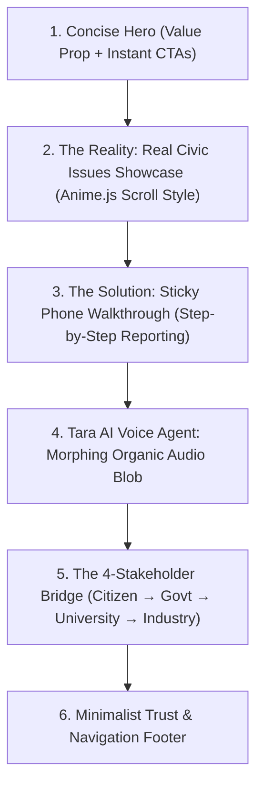

# 🚀 Setu: Bridging Societal Challenges with Innovation

> **Website Tagline:** Setu connects citizens, government, universities and industry to turn real-world challenges into verified, deployable solutions.  
> **Design Direction:** Anti-slop, concise, professional, high-impact civic tech.  
> **Inspiration:** Anime.js scroll choreography, Apple device showcase, tactile micro-motion.  
> **Core Objective:** Instantly communicate what the platform does, why it is uniquely superior to traditional grievance portals, and guide the user through an intuitive visual journey.

---

## 📐 Overall Page Architecture



---

## 1. Hero Section: Direct, Concise & Professional

### Design Goal
No generic AI buzzword salad. High contrast, clean typography, immediate clarity in under 3 seconds.

### Content & Elements
* **Brand & Eyebrow Badge:**  
  `Setu: Bridging Societal Challenges with Innovation`
* **Primary Headline (H1):**  
  **"Civic issues reported in seconds. Solved by real engineering."**
* **Subheadline:**  
  "Report with your voice, camera or text. Tara structures the challenge, government finds the need, universities build the solution, and industry helps take it to reality."
* **Primary CTAs:**
  1. `[ Report an Issue → ]` (High-contrast primary button)
  2. `[ View Public Tracking ]` (Ghost/bordered secondary button)
* **Live Proof Metrics (3 Minimalist Data Tickers):**
  * **`15s`** — Average voice intake time
  * **`0 Manual Forms`** — Camera & voice-first intake
  * **`4 Stakeholders`** — Citizens, Municipalities, Universities & Industry united

---

## 2. The Reality: Real Civic Issues Showcase (Anime.js Inspired)

### Design Goal
Before showing software or portals, ground the viewer in the authentic physical challenges Indian communities face every day. Use the 3 authentic ground-truth images provided.

### Visual Presentation & Animation Mechanics (Anime.js Style):
* **Layout Option A (Recommended - Staggered 3-Card Panoramic Grid):**  
  3 wide editorial cards with a dark gradient overlay at the base, crisp typography, and high-impact category tags. As the user scrolls into view, each card reveals with a staggered anime.js style cascade (`scale: 0.96 -> 1.0`, `translateY: 30px -> 0`, smooth damping).
* **Layout Option B (Sticky Parallax Dossier):**  
  As the user scrolls, each problem pins in view for a moment with dynamic contrast adjustments and metadata tags (e.g. `Location: Jharkhand Rural`, `Category: Water Security`, `Urgency: Critical`) before smoothly sliding up to reveal the next.
* **Micro-interactions:** Hovering over any card gently expands the photograph (`transform: scale(1.03)` with smooth cubic-bezier easing) and highlights the corresponding "SETU Intervention" pill.

### The 3 Ground-Truth Problems:

| # | Category Tag | Image Asset | Headline | The Challenge (Concise & Impactful) | The Setu Innovation Outcome |
|---|--------------|-------------|----------|-------------------------------------|-----------------------------|
| **01** | `WATER SECURITY & HEALTH` | `contaiminated water  source.png` | **"Toxic Water Bodies at City Doorsteps"** | Untreated sewage and industrial runoff choke urban river basins and drinking lines, triggering epidemics before formal tests are even logged. | Citizen snaps 1 photo; Tara auto-flags turbidity to municipal engineers and routes filtration R&D to university environmental labs. |
| **02** | `AGRICULTURE & CLIMATE` | `crop damage.jpg` | **"Unseasonal Floods, Submerged Harvests"** | Sudden downpours submerge standing crops within hours. Smallholder farmers struggle with paperwork while their entire season's livelihood rots. | Farmers speak in their local dialect to log geotagged field loss; state portals aggregate damage data for rapid relief and university seed trials. |
| **03** | `RURAL ENERGY & INFRASTRUCTURE` | `jharkhand vilage.png` | **"Panchayats Waiting on the Last Mile"** | Remote villages rely on isolated solar micro-grids and single feeder lines. When equipment fails, weeks pass before a technician receives the ticket. | Hands-free voice reports instantly notify district engineers, and equipment telemetry is routed to engineering teams for CSR-backed upgrades. |

---

## 3. The Solution: Sticky Phone Walkthrough (Mobile Reporting Flow)

### Design Goal
The centerpiece of the landing experience. A realistic, premium smartphone frame locks into sticky view in the center of the screen. As the user scrolls, the phone's screen dynamically transitions through each phase of the actual `/grass` reporting modal ([MobileReportingModal.jsx](file:///d:/project_sih43/apps/web-portal/src/portals/citizen/components/MobileReportingModal.jsx)), while alternating bullet points and value props slide in on the **Left** and **Right**.

### Visual Mechanics:
* **Center:** 3D-styled / Apple-precision phone bezel with smooth screen crossfades or slide transitions.
* **Left & Right Columns:** Staggered feature callouts that illuminate and activate in sync with the current step.

### Step-by-Step Sequence:

#### Step 1: Camera & Evidence Capture
* **Phone Screen Display:** Live camera viewfinder with shutter button, toggle for photo/video, and instant GPS lock indicator.
* **Left Column Callout:**
  * **Heading:** `01 / Visual Ground Truth`
  * **Bullets:**
    * Point-and-shoot camera interface with auto-exposure.
    * Supports both high-res photos and 10-second video evidence.
    * Eliminates fabricated complaints with real-time capture.
* **Right Column Callout:**
  * **Heading:** `Zero Typing Required`
  * **Bullets:**
    * Built for all literacy levels and regional citizens.
    * No complicated bureaucratic form dropdowns.

#### Step 2: Auto Geo-Tagging & Media Review
* **Phone Screen Display:** Swipeable media preview carousel with auto-detected latitude, longitude, and ward name badge (`Ranchi, Ward 12`).
* **Left Column Callout:**
  * **Heading:** `Precise Spatial Coordinates`
  * **Bullets:**
    * Automatic EXIF and device GPS verification.
    * Pinpoints exact ward, municipality, and nearest landmark.
* **Right Column Callout:**
  * **Heading:** `02 / Tamper-Proof Audit Trail`
  * **Bullets:**
    * Geolocation prevents duplicate reports across neighboring wards.
    * Municipal engineers receive exact turn-by-turn navigation coordinates.

#### Step 3: Multilingual Voice Intake (Speak or Type)
* **Phone Screen Display:** Clean minimalist notepad with glowing audio visualizer mic button (`"Tap to speak in your language"`).
* **Left Column Callout:**
  * **Heading:** `03 / Speak in Any Indian Language`
  * **Bullets:**
    * Powered by native Indian speech models (Hindi, Bengali, Tamil, Bhojpuri, etc.).
    * Automatic speech-to-text transcription with local dialect understanding.
* **Right Column Callout:**
  * **Heading:** `Natural Conversational Input`
  * **Bullets:**
    * Citizens simply describe what happened in their own words.
    * Auto-extracts urgency, duration, and impacted families.

#### Step 4: AI Deduplication & Department Routing
* **Phone Screen Display:** Sleek aura processing screen showing: Auto-categorized as `Public Health & Sanitation`, assigned to `Municipal Water Board`, Severity: `Critical`.
* **Left Column Callout:**
  * **Heading:** `04 / Instant Cognitive Triage`
  * **Bullets:**
    * Analyzes image and audio in parallel to determine true severity.
    * Automatically clusters 20+ complaints from the same street into one unified challenge.
* **Right Column Callout:**
  * **Heading:** `Zero Bureaucratic Routing Delay`
  * **Bullets:**
    * Dispatched directly to the designated nodal officer's dashboard.
    * Eliminates manual sorting backlogs in municipal offices.

#### Step 5: Verified Review & Live Tracking Card
* **Phone Screen Display:** Final card summary with unique Citizen Tracking ID (`#STU-8492`), estimated resolution timeline, and 1-tap WhatsApp/SMS updates toggle.
* **Left Column Callout:**
  * **Heading:** `05 / 100% Transparent Accountability`
  * **Bullets:**
    * Unique trackable token issued instantly.
    * Citizens track status in real-time without visiting government offices.
* **Right Column Callout:**
  * **Heading:** `Two-Way Feedback Loop`
  * **Bullets:**
    * Automated milestone notifications when work crews are dispatched.
    * Photo verification required before an issue is marked resolved.

---

## 4. Tara AI: The Multilingual Voice Assistant & Audio Blob

### Design Goal
Highlight **Tara**, the platform's autonomous voice copilot that bridges digital literacy barriers through natural phone conversations.

### Visual Centerpiece: Morphing Organic Audio Blob
* An organic, glowing, sound-reactive blob that pulses smoothly in idle state and expands dynamically when active.
* Ultra-smooth CSS keyframes / Canvas math with ambient backdrop glow.
* Ready to plug into the specific animation or shader library reference you find online.

### Content & Capabilities:
* **Section Tag:** `MEET TARA · VOICE COPILOT`
* **Headline:** **"The government official that never puts you on hold."**
* **Key Highlights (Concise 3-Pillar Layout):**
  1. 🗣️ **Conversational Intake:** Citizens can simply dial a toll-free number or tap the in-app mic to report issues without touching a keyboard.
  2. 📞 **Proactive Verification Calls:** Tara places outbound calls to reporters to verify resolution quality before complaints are closed.
  3. 🌐 **12+ Indian Languages:** Speaks and understands local dialects without sounding like a robotic IVR menu.

---

## 5. The Complete Ecosystem Bridge (How We're Unique & Best)

### Design Goal
Show why SETU is different from standard grievance portals (like CPGRAMS or municipal WhatsApp bots). Standard portals just log complaints; **SETU transforms recurring civic problems into funded academic R&D projects.**

### 4-Card Unified Bento Grid:

```
┌───────────────────────────────────────┬───────────────────────────────────────┐
│ 1. CITIZEN (Grass)                    │ 2. GOVERNMENT (Oak)                   │
│ Voice & media reporting in 15 seconds.│ AI clusters identical issues into     │
│ Direct tracking without paperwork.    │ unified state-level engineering briefs│
├───────────────────────────────────────┼───────────────────────────────────────┤
│ 3. UNIVERSITY (Saplings)              │ 4. INDUSTRY & CSR (Grove)             │
│ Engineering labs adopt real problems  │ CSR capital and grants directly fund  │
│ as funded capstone R&D challenges.    │ vetted student prototypes at scale.   │
└───────────────────────────────────────┴───────────────────────────────────────┘
```

---

## 6. Implementation Technical Architecture

1. **Lightweight & Fast:** Built with pure React + modern CSS (GPU accelerated `transform` and `opacity`) to ensure 60fps on mobile and low-spec laptops.
2. **Scroll Trigger Engine:** Clean IntersectionObserver or lightweight scroll-progress hook (no bulky 200KB third-party physics libraries needed unless desired).
3. **Responsive Degradation:**
   * **Desktop (>1024px):** Full sticky phone frame with alternating floating narrative cards.
   * **Tablet / Mobile (<1024px):** Smooth horizontal swipeable step cards with embedded interactive mini-device frames.
4. **Modularity:** Isolated components:
   * `HeroSection.jsx`
   * `IssuesShowcaseSection.jsx`
   * `PhoneWalkthroughSection.jsx`
   * `TaraBlobSection.jsx`
   * `EcosystemBentoSection.jsx`

---

## 📋 Approval Checklist & Next Steps
- [ ] Review the proposed headline and narrative tone.
- [ ] Confirm the 3-4 issue images & categories (Potholes, Water, Waste, Electrical).
- [ ] Confirm the 5-step phone progression matching [MobileReportingModal.jsx](file:///d:/project_sih43/apps/web-portal/src/portals/citizen/components/MobileReportingModal.jsx).
- [ ] Share the online blob / anime.js animation reference when ready so we can adapt its exact mechanics.
