# 🏛️ SETU - End-to-End System Blueprint & Ecosystem Architecture
**Smart India Hackathon (SIH 2024 / PS 26043)**  
*Organization: Government of Jharkhand | Department: Higher & Technical Education*

---

## 🎯 Ecosystem Overview & Vision
Communities across Jharkhand face thousands of grassroots challenges (water contamination, rural health access, agriculture diseases, road infrastructure, education). Currently, these problems remain fragmented. Meanwhile, universities have talented students and researchers seeking real-world projects, and industries have CSR funds and scaling expertise looking for impactful grassroots innovation.

**SETU** is the digital bridge uniting **Citizens & Local Bodies**, the **Government of Jharkhand**, **Universities (SPOC + Teams)**, and **Industry/CSR Partners** into a unified, transparent problem-solving pipeline.

---

## 👥 The 4 Core Portals & User Roles

```mermaid
graph LR
    subgraph 1. Intake
        Citizen["📱 Citizen & Local Bodies<br/>(Mobile & Desktop Portal)"]
    end
    
    subgraph 2. Governance
        Gov["🏛️ Govt Nodal Officer<br/>(DHTE + Line Ministries)"]
    end

    subgraph 3. Academia
        SPOC["🎓 University SPOC<br/>(Dean / Nodal Lead)"]
        Teams["🔬 Student & Faculty Teams<br/>(R&D Solvers)"]
    end

    subgraph 4. Market & Scale
        Industry["🏢 Industry & CSR Partners<br/>(Mentors, Funders, MSMEs)"]
    end

    Citizen -->|1. Submit Problem + Evidence| Gov
    Gov -->|2. AI Triage & Allocate Problem| SPOC
    SPOC -->|3. Approve & Assign Teams| Teams
    Teams -->|4. Build Prototype & Post Milestones| SPOC
    SPOC -->|5. SPOC Verification| Gov
    Gov -->|6. Govt Impact Sign-off & Field Deploy| Citizen
    Teams <-->|Collaborate, Mentor, CSR Grant| Industry
```



---

### 1. 📱 Citizen & Community Reporting Portal
* **Target Users**: Everyday citizens, Village Youth, Panchayati Raj Institutions (Gram Panchayats), Urban Local Bodies (ULBs), NGOs, and Pragya Kendra operators.
* **Device Optimization**:
  * **Mobile-First (Budget Phones)**: Lightweight, 1-tap camera access, big touch buttons, PWA installable (<2MB), WhatsApp share.
  * **Desktop (Gram Panchayat / CSC PCs)**: Full multi-column view, detailed document upload, public challenge explorer.
* **Core Capabilities**:
  * **Multi-Modal Intake**: Submit problems via text, photos, video clips, and supporting PDF/documents.
  * **TARA AI Voice Assistant**: Voice-based grievance registration in Hindi and regional dialects for citizens with low digital literacy.
  * **Geo-Tagging**: Auto GPS location capture (`navigator.geolocation`) + manual Jharkhand District / Block / Panchayat picker.
  * **Community Upvoting**: Community members can upvote and endorse local issues to highlight urgency and crowdsourced priority.
  * **Public Transparency Tracker**: Track ticket lifecycle in real-time (`Submitted ➔ AI Triaged ➔ Assigned to University ➔ Team Formed ➔ Prototype Ready ➔ Resolved`).

---

### 2. 🏛️ Government Portal (Review, Allocation & Validation)
* **Target Users**:
  * **State Nodal Officers**: Department of Higher & Technical Education (DHTE) — central admin.
  * **Thematic Line Departments**: Drinking Water & Sanitation (DWSD), Agriculture, Health, Rural Development, Urban Development, Energy, etc.
  * **District Planning Officers**: DC / DM offices across Jharkhand's 24 districts.
* **Core Capabilities**:
  * **AI Problem Review Queue**: View incoming tickets triaged by AI (Domain tag, Deduplication score, Severity matrix).
  * **Task & Challenge Creation**: Convert grassroots problems into official **"State Innovation Challenges"** with defined problem statements and impact metrics.
  * **Institutional Routing & Allocation**: Assign validated challenges to appropriate universities based on academic specialization, labs, and faculty domain expertise (e.g., Water R&D to IIT ISM Dhanbad / BIT Mesra; Agro-tech to Birsa Agricultural University).
  * **Grant & Seed Funding Approval**: Sanction government innovation grants / prototyping budgets for approved university projects.
  * **Claim & Milestone Verification**: Verify university progress updates following SPOC endorsement, inspect field pilot results, and issue official impact certificates.

---

### 3. 🎓 University Portal (SPOC & Student/Faculty Teams)
The university portal is divided into **two specialized sub-roles**:

#### A. University SPOC (Single Point of Contact / Dean of R&D / Incubation Lead)
* **Responsibilities**:
  * **Receive Assigned Challenges**: Review challenges routed to the university by the Government.
  * **Team Formation & Approval**: Review applications from student/faculty teams, constitute multidisciplinary project squads, and assign designated faculty mentors.
  * **Institutional Governance**: Monitor project milestones, budget utilization, and ensure academic rigor.
  * **Primary Milestone Verification**: First-level verification of team deliverables before submission to the Government and public feed.

#### B. Student & Faculty Innovator Teams
* **Responsibilities**:
  * **Bidding & Proposing**: Submit formal solution proposals, research blueprints, tech stacks, and expected budgets.
  * **R&D & Prototyping**: Build physical hardware prototypes, software solutions, or policy models.
  * **Public Project Showcase & Progress Logging**: Regularly log milestones (photos of prototypes, field test videos, GitHub repos, patent filings, test results).
  * **Stakeholder Feedback**: Respond to feedback from government inspectors, citizen beneficiaries, and industry mentors.

---

### 4. 🏢 Industry & CSR Collaboration Portal
* **Target Users**: Startups, MSMEs, Large Enterprises (Tata Steel, Coal India, NTPC, etc.), Corporate CSR Directors, Venture Funds, and Research Labs.
* **Core Capabilities**:
  * **Project Discovery Feed**: Explore active university projects solving real Jharkhand problems, filterable by sector (Agro, Clean Water, Solar, Health) and district.
  * **Mentorship & Co-Development**: Industry engineers can offer technical mentorship, lab testing access, or engineering reviews to university teams.
  * **CSR Funding & Grants**: Pledge CSR grants or matching funds for high-potential prototypes needing pilot testing.
  * **Direct Collaboration & Contact**: Initiate direct messaging and MoU discussions with university teams and SPOCs.
  * **Technology Transfer & Commercialization**: License patents, acquire IP, or incubate student startups for commercial deployment in Jharkhand and across India.

---

## 🔄 End-to-End Problem Lifecycle State Machine

```text
[1. CITIZEN_SUBMITTED]
       │ (Citizen reports issue via Web/Mobile/Voice with GPS & Media)
       ▼
[2. AI_TRIAGED]
       │ (NLP classifies domain, detects duplicates, scores urgency)
       ▼
[3. GOVT_REVIEWED & APPROVED]
       │ (Govt Dept validates problem and converts into University Challenge)
       ▼
[4. ASSIGNED_TO_UNIVERSITY]
       │ (Routed to matched HEIs based on research & lab capability)
       ▼
[5. SPOC_TEAM_FORMED]
       │ (University SPOC reviews, forms student/faculty team, assigns Mentor)
       ▼
[6. PROPOSAL_SUBMITTED]
       │ (Team uploads design blueprint, timeline & seed funding request)
       ▼
[7. INDUSTRY_PARTNERED (Optional/Parallel)]
       │ (Industry/CSR pledges mentorship, funds, or pilot deployment support)
       ▼
[8. MILESTONE_IN_PROGRESS]
       │ (Team works on R&D, uploads prototype photos, test logs, code)
       ▼
[9. SPOC_VERIFIED]
       │ (University SPOC conducts lab inspection and signs off on milestone)
       ▼
[10. GOVT_VALIDATED]
       │ (Govt Nodal Officer verifies claim, disburses funds, conducts field trial)
       ▼
[11. RESOLVED_AND_DEPLOYED]
       │ (Solution deployed in target Jharkhand village/ward; Citizen notified)
```

---

## 🗺️ Detailed Phase-by-Phase Implementation Plan

### ✅ Phase 1: Cleanup & Foundation (COMPLETED)
- Removed Flutter mobile app and associated platform scripts.
- Consolidated repository into **100% React (Vite)** + **Flask AI Backend**.
- Synchronized documentation, architecture diagrams, and OpenAPI specifications.

---

### ⏳ Phase 2: Responsive Citizen Reporting Portal (NEXT UP)
- **Routes**: `/report` (Reporting wizard), `/citizen` (Citizen hub), `/track/:id` (Live issue tracker).
- **Responsive Layout**:
  - Mobile bottom navigation bar + full-screen floating action sheet.
  - Desktop multi-column layout with category cards and recent submissions.
- **Key Features**:
  1. Multi-step reporting wizard (Title, Description, Category, Urgency).
  2. Integrated Camera & Media Upload (Photo/Video capture via browser).
  3. Jharkhand District/Block selector + 1-click GPS auto-detection.
  4. TARA AI Voice Reporting overlay (Web Audio mic recording connected to Sarvam/Gemini backend).
  5. Public problem explorer with upvoting and district filters.

---

### ⏳ Phase 3: Government Review & University Allocation
- **Routes**: `/government/problems`, `/government/challenges`, `/government/funding`.
- **Key Features**:
  1. Department-wise Problem Review Queue.
  2. AI matchmaker suggestion card (recommends best-fit universities based on faculty and past projects).
  3. 1-Click action to create & assign challenge to University SPOCs.
  4. Budget and CSR co-funding allocation dashboard.

---

### ⏳ Phase 4: University Portal (SPOC & Student/Faculty Teams)
- **Routes**: `/university/challenges`, `/university/teams`, `/university/projects`, `/university/milestones`.
- **Key Features**:
  1. **SPOC Dashboard**: View incoming challenges, create/approve student-faculty teams, assign faculty mentors.
  2. **Team Workspace**: Proposal submission, budget requests, task boards.
  3. **Milestone Tracker & Public Showcase**: Upload progress logs, lab photos, and testing outcomes.
  4. **SPOC Sign-off**: Verification workflow before milestone claims go to Government.

---

### ⏳ Phase 5: Industry & CSR Collaboration
- **Routes**: `/industry/challenges`, `/industry/projects`, `/industry/collaborations`, `/industry/funding`.
- **Key Features**:
  1. Public/Industry Innovation Feed: Browse ongoing university solutions across Jharkhand.
  2. CSR Grant Pledge & Funding Commitment system.
  3. Mentorship & Collaboration request module to contact teams and SPOCs.
  4. Pilot testing and technology transfer agreement workflow.

---

### ⏳ Phase 6: Analytics, Notifications & Hackathon Polish
- Real-time cross-stakeholder notifications (In-app alerts + simulated SMS/WhatsApp for citizens).
- Government Visual Analytics Dashboard (Submissions, Domain breakdown, University league table, Impact metrics).
- End-to-end testing, responsive polish, and Vercel cloud deployment.
